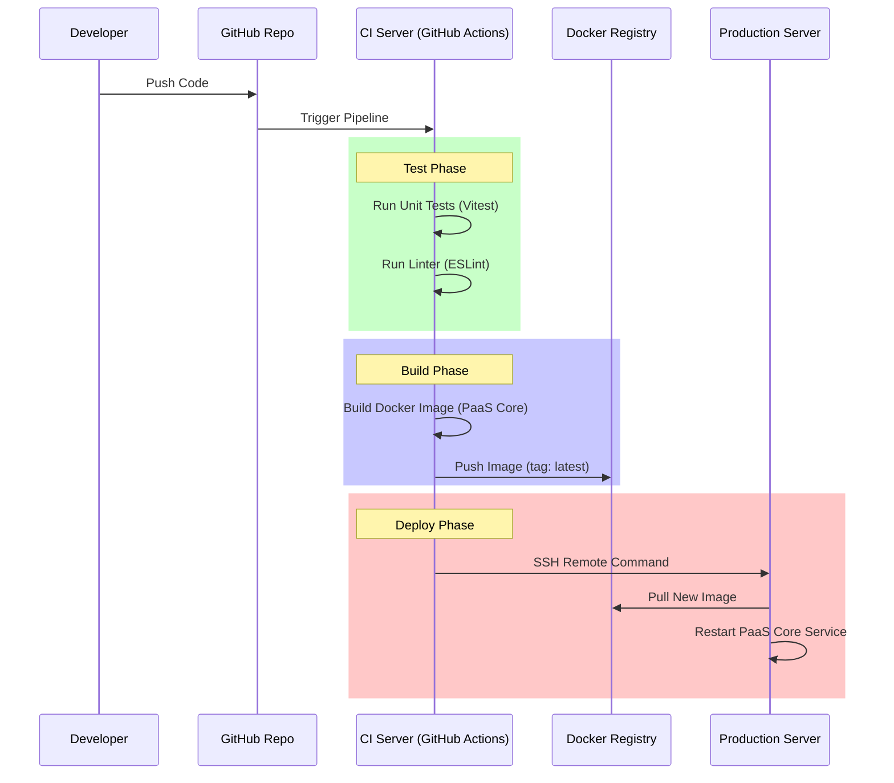

# Dokumentasi Sistem PaaS (Platform as a Service)

Dokumentasi ini disusun berdasarkan kerangka kerja **NIST Cloud Computing Reference Architecture (CCRA)** untuk menjelaskan arsitektur, lingkungan, dan manajemen sistem PaaS yang telah dibangun.

---

## 1. Rancangan Environment dan Konfigurasi

Sistem ini dirancang sebagai layanan **PaaS (Platform as a Service)** yang berjalan di atas infrastruktur hybrid (Windows/Linux) dengan containerization sebagai fondasi utama.

### Pilihan Produk & Teknologi
| Komponen NIST | Teknologi / Produk | Alasan Pemilihan |
|---|---|---|
| **Physical Layer** | Windows (Dev) / Linux (Prod) | Lingkungan pengembangan lokal yang fleksibel, siap untuk deployment produksi di Linux. |
| **Resource Abstraction** | **Docker Engine** | Standar industri untuk isolasi aplikasi dan manajemen resource yang efisien. |
| **Service Orchestration** | **Node.js (Fastify)** | Framework backend yang cepat (low overhead) dan asinkronus untuk menangani request concurrent. |
| **Data Storage** | **PostgreSQL (via Prisma)** | Database relasional yang kuat untuk data tenant, user, dan metadata aplikasi. |
| **Build System** | **Nixpacks** | Engine build otomatis yang mendeteksi bahasa pemrograman tanpa Dockerfile manual. |
| **Ingress/Routing** | **Traefik** | Reverse proxy cloud-native yang otomatis mendeteksi dan merutekan container baru. |

### Konfigurasi
-   **Network**: docker network `paas-network` untuk isolasi traffic internal.
-   **Storage**: Volume docker persisten untuk PostgreSQL.
-   **Security**: JWT (JSON Web Token) untuk autentikasi stateless antar servis.

---

## 2. Diagram Arsitektur Multi-tenancy

Sistem mengadopsi model **Isolation-per-Container** di mana setiap aplikasi tenant berjalan di container terpisah, namun berbagi database dan infrastruktur yang sama (Shared Resource, Isolated Execution).


### Manajemen Tenant
-   **Logika Isolasi**: Middleware backend memfilter akses resource berdasarkan `userId` (Owner-based Access Control).
-   **Aplikasi Manajemen**: Dashboard Admin (SvelteKit) memungkinkan Superadmin melihat, menghentikan, atau menghapus aplikasi lintas tenant.

---

## 3. Resource Abstraction & Provisioning

Bagian ini menjelaskan bagaimana sistem menyembunyikan kompleksitas infrastruktur fisik dari pengguna.

### Resource Abstraction
Pengguna tidak perlu mengetahui OS host atau manajemen kernel.
-   **Compute**: Diabstraksi menjadi "Container" dengan batasan CPU/RAM (via Docker Stats).
-   **Network**: Diabstraksi menjadi "Subdomain" (`app.domain.com`) tanpa konfigurasi IP manual.

### Provisioning Workflow
Proses provisioning berjalan otomatis (Automated Service Provisioning):
1.  **Request**: User mengirim URL Git.
2.  **Abstraksi Build**: `Nixpacks` menganalisis kode -> menentukan runtime -> membuat OCI Image.
3.  **Deployment**: Orchestrator membuat container baru dengan environment variables yang dikonfigurasi.
4.  **Routing**: Traefik mendeteksi container baru dan mendaftarkan route secara instan.

### Business Support Layer
-   **Billing/Metering** (Future): API `/metrics` sudah tersedia untuk menghitung penggunaan CPU/RAM per container sebagai dasar penagihan.
-   **Reporting**: Dashboard menyediakan visualisasi status real-time.

---

## 4. Rancangan Monitoring

Monitoring dilakukan secara _proactive_ dan _granular_ per container.

### Mekanisme Monitoring
1.  **Container Metrics**:
    -   API Endpoint: `/apps/:id/metrics` memanfaatkan `docker stats` API.
    -   Metrik: CPU Usage (%), Memory Usage (MB/%), Network I/O.
    -   Visualisasi: Ditampilkan pada Dashboard Pengguna secara real-time.

2.  **Log Streaming (Observability)**:
    -   Menggunakan **Server-Sent Events (SSE)** untuk streaming log build dan runtime secara real-time dari server ke browser.
    -   Memungkinkan pengguna mendebug kegagalan deployment seketika.

3.  **Health Check (Background Job)**:
    -   Job `syncContainerStatus` berjalan setiap 10 detik.
    -   Fungsi: Menyelaraskan status database dengan status aktual container Docker (Self-Healing state reflection).

---

## 5. Rancangan CI/CD (Proposed)

Untuk pengembangan platform PaaS ini sendiri, berikut adalah usulan pipeline CI/CD modern:

### Pipeline Flow


### Komponen CI/CD
1.  **Version Control**: GitHub (Branch Protection pada `main`).
2.  **Continuous Integration**:
    -   Automated Testing pada setiap Pull Request.
    -   Static Code Analysis untuk menjaga kualitas kode TypeScript.
3.  **Continuous Deployment**:
    -   **Rollback Strategy**: Menyimpan `tag` image sebelumnya untuk pemulihan cepat jika `latest` bermasalah.

---

## 6. Lampiran: Panduan Instalasi Teknis

Petunjuk singkat untuk menjalankan PaaS ini di lingkungan lokal (Dev).

### Persyaratan
- Node.js & npm
- Docker Desktop (Status: Running)

### Instalasi & Jalankan
1.  **Install Dependensi**:
    ```bash
    npm install
    cd web && npm install && cd ..
    ```
2.  **Setup Database**:
    ```bash
    # Menjalankan PostgreSQL & Traefik
    docker-compose up -d
    
    # Migrasi Schema Database
    npx prisma migrate dev
    ```
3.  **Jalankan Aplikasi**:
    ```bash
    # Terminal 1 (Backend - Port 3000)
    npm run dev

    # Terminal 2 (Frontend - Port 5173)
    cd web
    npm run dev
    ```

Akses Dashboard di `http://localhost:5173`.
